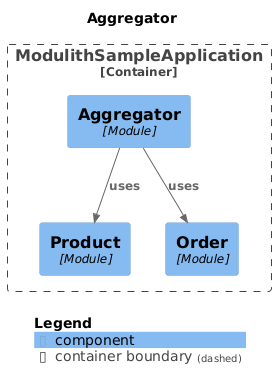

## Sample Spring Modulith

This project uses Spring Modulith in a little way with 2 domains (stock and product) 
and a module that aggregate both modules.




```

├── stock
│   ├── controller
│   ├── domain
│   ├── repository
│   └── service
│
├── stock
│   ├── controller
│   ├── domain
│   ├── repository
│   └── service
│
└── product
│   ├── controller
│   ├── domain
│   ├── repository
│   └── service
```

### Requirements

* Java 21
* Maven

### Reference Documentation

For further reference, please consider the following sections:

* [Official Apache Maven documentation](https://maven.apache.org/guides/index.html)
* [Spring Boot Maven Plugin Reference Guide](https://docs.spring.io/spring-boot/docs/3.3.2/maven-plugin/reference/html/)
* [Spring Modulith](https://docs.spring.io/spring-modulith/reference/)
* [Spring Web](https://docs.spring.io/spring-boot/docs/3.3.2/reference/htmlsingle/index.html#web)
